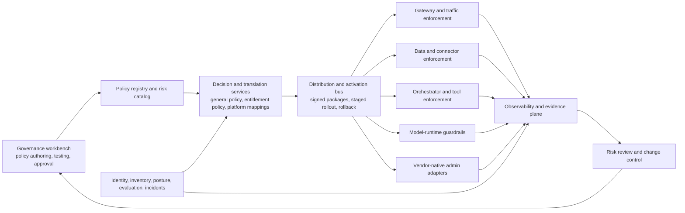

# What control-plane architecture is required to manage Artificial Intelligence (AI) agents and low-code systems as distributed, semi-autonomous actors within enterprise environments?

## Research Question

What control-plane architecture is required to manage AI agents and low-code systems as distributed, semi-autonomous actors within enterprise environments, specifically, how should policies be created, propagated, and enforced; how should control, execution, and observability layers interact; and how should feedback loops be established to continuously adapt governance controls based on system behaviour?

## Scope

**In scope:**
- Control-plane architecture definition: what components constitute a control plane for governing AI agents and low-code systems at scale (policy authoring, policy store, policy distribution, enforcement points, observability, feedback and adaptation)
- Policy creation and propagation: how governance policies should be authored (policy-as-code or structured policy), stored, versioned, and propagated to distributed enforcement points across a multi-vendor, multi-platform enterprise environment
- Enforcement layer interaction: how the control plane coordinates with enforcement points at different architectural layers (Application Programming Interface (API) gateway, data access, orchestration, model runtime), including the relationship between policy decision points and policy enforcement points
- Observability integration: how the control plane consumes observability data (Q4) to detect policy violations, performance anomalies, and emerging risks, and what the feedback mechanism from observability to policy adaptation looks like
- Feedback and adaptation: how governance controls are continuously updated in response to observed system behaviour, including what triggers a policy update, what the update process requires (risk assessment, testing, approval, deployment), and how quickly adaptation can occur
- Architectural patterns: how existing control-plane architectures (zero trust network access, service mesh control planes, cloud-native policy engines) can be adapted for AI governance
- Integration with all upstream items: how the accountability model (Q1), identity model (Q2), enforcement architecture (Q3), observability model (Q4), risk tier framework (Q5), data governance (Q6), lifecycle model (Q7), human-in-the-loop model (Q9), SDLC integration (Q10), vendor constraints (Q11), and failure mode analysis (Q12) compose into a coherent control-plane design

**Out of scope:**
- Individual component design (covered by Q1–Q12)
- Maturity model for governance programmes (covered by Q13)
- Economic analysis of control-plane implementation (covered by Q8)

**Constraints:**
- This item is the synthesis of Q1–Q12 and Q15; it should not be attempted until those items are substantially complete, as it depends on their findings to produce a coherent architecture rather than a generic reference architecture
- The architecture must be designed to operate in a multi-vendor, multi-platform enterprise environment, not optimised for a single cloud or platform
- Must address both the steady-state governance architecture and the bootstrap problem: how an organisation builds toward the full control-plane architecture when it is currently starting from a low-maturity baseline

## Context

- [inference; source: https://github.com/davidamitchell/Research/blob/main/Research/completed/2026-04-22-enterprise-ai-platform-operating-models.md; https://github.com/davidamitchell/Research/blob/main/Research/completed/2026-04-22-enterprise-ai-capability-model.md; https://github.com/davidamitchell/Research/blob/main/Research/completed/2026-04-24-business-led-low-code-agent-governance.md; https://github.com/davidamitchell/Research/blob/main/Research/completed/2026-04-26-multi-ai-provider-control-planes.md] Prior completed repository work already separates operating model, capability layering, bounded low-code governance, and multi-provider control surfaces, so this capstone item can focus on architectural synthesis rather than re-proving each subproblem.

- [fact; source: https://csrc.nist.gov/pubs/sp/800/207/final] National Institute of Standards and Technology (NIST) Special Publication (SP) 800-207 provides the closest mature analogue because it explicitly separates policy decision, policy administration, policy enforcement, and supporting telemetry sources into a control plane that is distinct from the protected data plane.

Cross-references:
- Q1: `2026-04-26-ai-lowcode-decision-rights-accountability-liability` (accountability structure)
- Q2: `2026-04-26-ai-agent-identity-access-management-enterprise` (identity substrate)
- Q3: `2026-04-26-ai-lowcode-governance-enforcement-architecture` (enforcement layer)
- Q4: `2026-04-26-ai-lowcode-observability-telemetry-governance` (observability layer)
- Q5: `2026-04-26-ai-lowcode-risk-tier-classification-controls` (risk tier framework)
- Q6: `2026-04-26-data-governance-ai-lowcode-enterprise-enforcement` (data governance integration)
- Q7: `2026-04-26-ai-lowcode-lifecycle-management` (artefact lifecycle)
- Q9: `2026-04-26-human-in-the-loop-ai-automated-workflows` (human oversight integration)
- Q10: `2026-04-26-ai-lowcode-sdlc-platform-engineering-integration` (pipeline integration)
- Q11: `2026-04-26-vendor-platform-governance-constraints-compensating-controls` (vendor constraints)
- Q12: `2026-04-26-ai-lowcode-failure-modes-governance-mitigation` (failure mode handling)
- Q15: `2026-04-26-ai-lowcode-regulatory-compliance-alignment` (regulatory requirements)

## Approach

1. **Control-plane component model:** Define the components of an enterprise AI/low-code governance control plane, drawing on the zero trust architecture model (National Institute of Standards and Technology (NIST) Special Publication (SP) 800-207) and service mesh control-plane patterns (Istio, Linkerd). For each component, specify its function, its inputs and outputs, and its interface with other components.
2. **Policy lifecycle in the control plane:** Define how governance policies move through the control plane, including authoring (policy-as-code), validation, storage, version control, distribution to enforcement points, and retirement. Assess Open Policy Agent (OPA), Cedar, and Azure Policy as policy engine options.
3. **Enforcement coordination:** Define how the control plane coordinates enforcement across multiple layers (API gateway, data access, model runtime), including how policies are translated into layer-specific enforcement rules, and how conflicts between enforcement layers are resolved.
4. **Observability feedback loop:** Define the feedback loop from observability (Q4) to control plane to policy adaptation: what signals from the observability layer trigger a policy review, what the review and update process requires, and how quickly the adaptation cycle can operate while maintaining governance assurance.
5. **Architectural patterns survey:** Review zero trust architecture, service mesh control planes, and cloud-native policy engines (Amazon Web Services (AWS) Service Control Policies (SCP), Azure Policy, OPA Gatekeeper) for architectural patterns applicable to AI governance control planes.
6. **Bootstrap problem:** Propose an implementation roadmap for an organisation building toward the full control-plane architecture from a low-maturity baseline, including what components to implement first, what interim compensating controls bridge the gap, and how the architecture evolves through the maturity stages defined in Q13.
7. **Reference architecture:** Produce a reference architecture diagram and component specification for an enterprise AI/low-code governance control plane, integrating the findings of all upstream items.

## Sources

- [x] [National Institute of Standards and Technology (NIST) Special Publication (SP) 800-207 - Zero Trust Architecture](https://csrc.nist.gov/pubs/sp/800/207/final) - primary architectural reference; defines the policy decision point (PDP), policy enforcement point (PEP), and policy administration point (PAP) model applicable to AI governance control planes
- [x] [Open Policy Agent (OPA) - policy engine architecture](https://www.openpolicyagent.org/docs/latest/philosophy/) - open-source policy engine; assess for control-plane policy store and decision engine role
- [x] [Cedar policy language](https://docs.cedarpolicy.com/) - Amazon's policy language and engine; assess as alternative to OPA for control-plane policy decisions
- [x] [Azure Policy - enterprise policy management at scale](https://learn.microsoft.com/en-us/azure/governance/policy/overview) - cloud-native policy enforcement; assess for AI governance control-plane integration
- [x] [Istio - service mesh control plane](https://istio.io/latest/docs/concepts/what-is-istio/) - service mesh control-plane architecture; assess for architectural pattern applicability to AI agent governance
- [x] [NIST Artificial Intelligence Risk Management Framework (AI RMF) 1.0](https://www.nist.gov/publications/artificial-intelligence-risk-management-framework-ai-rmf-10) - assess for control-plane function alignment with NIST AI RMF structure
- [x] [NIST AI RMF Core](https://airc.nist.gov/airmf-resources/airmf/5-sec-core/) - primary source for Govern, Map, Measure, and Manage lifecycle functions
- [x] [NIST AI RMF Playbook](https://airc.nist.gov/AI_RMF_Knowledge_Base/Playbook) - companion guidance on tailoring lifecycle actions
- [x] [European Union (EU) AI Act](https://eur-lex.europa.eu/legal-content/EN/TXT/?uri=CELEX%3A32024R1689) - canonical legal text for high-risk lifecycle obligations
- [x] [EU AI Act Service Desk - Article 9](https://ai-act-service-desk.ec.europa.eu/en/ai-act/article-9) - continuous iterative risk-management obligations
- [x] [EU AI Act Service Desk - Article 12](https://ai-act-service-desk.ec.europa.eu/en/ai-act/article-12) - logging and traceability obligations
- [x] [EU AI Act Service Desk - Article 72](https://ai-act-service-desk.ec.europa.eu/en/ai-act/article-72) - post-market monitoring obligations
- [x] [OPA bundle distribution](https://www.openpolicyagent.org/docs/latest/management-bundles/) - runtime policy distribution and activation pattern
- [x] [OPA decision logs](https://www.openpolicyagent.org/docs/latest/management-decision-logs/) - observability and audit pattern
- [x] [Amazon Verified Permissions](https://docs.aws.amazon.com/verifiedpermissions/latest/userguide/what-is-avp.html) - managed authorization control-plane pattern for Cedar
- [x] [Amazon Verified Permissions terminology](https://docs.aws.amazon.com/verifiedpermissions/latest/userguide/terminology.html) - policy-store, authorization-request, and enforcement model details
- [x] [Amazon Verified Permissions policy templates](https://docs.aws.amazon.com/verifiedpermissions/latest/userguide/policy-templates.html) - template-linked policy propagation model
- [x] [Azure Policy effects](https://learn.microsoft.com/en-us/azure/governance/policy/concepts/effect-basics) - effect precedence and cumulative-most-restrictive behavior
- [x] [Azure Policy evaluation triggers](https://learn.microsoft.com/en-us/azure/governance/policy/how-to/get-compliance-data#evaluation-triggers) - event-driven and recurring compliance evaluation
- [x] [Istio architecture](https://istio.io/latest/docs/ops/deployment/architecture/) - explicit control-plane and data-plane split

---

## Research Skill Output

*(Full output from running the research skill, retained verbatim in the completed item. §§0-5 are the investigation; §6 seeds the Findings section below.)*

### §0 Initialise

- [fact; source: https://csrc.nist.gov/pubs/sp/800/207/final; https://www.nist.gov/publications/artificial-intelligence-risk-management-framework-ai-rmf-10] This item asks for an enterprise control-plane architecture that can author, propagate, enforce, observe, and adapt governance policy across Artificial Intelligence (AI) agents and low-code systems by borrowing the most relevant elements from zero trust and lifecycle risk-management frameworks.
- [fact; source: https://github.com/davidamitchell/Research/blob/main/Research/completed/2026-04-22-enterprise-ai-platform-operating-models.md; https://github.com/davidamitchell/Research/blob/main/Research/completed/2026-04-22-enterprise-ai-capability-model.md; https://github.com/davidamitchell/Research/blob/main/Research/completed/2026-04-24-business-led-low-code-agent-governance.md; https://github.com/davidamitchell/Research/blob/main/Research/completed/2026-04-26-multi-ai-provider-control-planes.md] Prior completed repository work already established four relevant premises: enterprise AI needs a central operating model, low-code agent creation must stay inside bounded governance, capability building should be layered, and multi-provider AI control currently splits between vendor-native administration planes and runtime gateways.
- [fact; source: https://csrc.nist.gov/pubs/sp/800/207/final; https://airc.nist.gov/airmf-resources/airmf/5-sec-core/; https://ai-act-service-desk.ec.europa.eu/en/ai-act/article-9; https://ai-act-service-desk.ec.europa.eu/en/ai-act/article-12; https://ai-act-service-desk.ec.europa.eu/en/ai-act/article-72] The governing constraints for this synthesis are cross-platform operation, explicit interaction between control, execution, and observability layers, and a feedback loop that meets both NIST-style continuous risk management and European Union (EU) Artificial Intelligence Act lifecycle-monitoring expectations.
- [fact; source: https://github.com/davidamitchell/Research/blob/main/Research/completed/2026-04-22-enterprise-ai-platform-operating-models.md; https://github.com/davidamitchell/Research/blob/main/Research/completed/2026-04-22-enterprise-ai-capability-model.md] The intended output is `knowledge`: a reference architecture, component specification, and bootstrap roadmap that integrate prior repository conclusions with primary-source architecture and policy-engine evidence.

### §1 Question Decomposition

1. **Control-plane component model**
   1. What is the minimum logical decomposition of an AI governance control plane?
   2. Which control-plane components correspond to policy administration point (PAP), policy decision point (PDP), and policy enforcement point (PEP) roles?
   3. Which supporting data sources must feed policy decisions and policy adaptation?
2. **Policy lifecycle**
   1. How should policy be authored, validated, versioned, approved, and retired?
   2. Which parts of the lifecycle are best handled by a portable policy engine, an authorization language, or a cloud-native assignment system?
   3. How should policy be distributed, activated, and rolled back across heterogeneous enforcement points?
3. **Enforcement coordination**
   1. Which enforcement layers matter in enterprise AI and low-code systems?
   2. How should one high-level governance policy be translated into layer-specific rules?
   3. What conflict-resolution rule should apply when different layers disagree?
4. **Observability feedback loop**
   1. Which telemetry and logging signals are necessary for governance adaptation?
   2. Which events should trigger policy review, remediation, or rollback?
   3. What human approval and testing steps are required before a new policy goes live?
5. **Architectural patterns survey**
   1. What should be borrowed from zero trust architecture?
   2. What should be borrowed from service mesh control planes?
   3. What should be borrowed from cloud-native policy systems and risk-management frameworks?
6. **Bootstrap roadmap**
   1. What can a low-maturity enterprise implement first?
   2. Which compensating controls bridge the gap before full automation exists?
   3. What steady-state architecture should the roadmap converge toward?

### §2 Investigation

- [fact; source: https://docs.cedarpolicy.com/; https://docs.aws.amazon.com/verifiedpermissions/latest/userguide/what-is-avp.html] Access note: the seeded Cedar subpage returned 404 in this session, so Cedar evidence was taken from the current Cedar reference-guide root and Amazon Verified Permissions documentation.

#### A. Control-plane component model

- [fact; source: https://csrc.nist.gov/pubs/sp/800/207/final] NIST SP 800-207 splits zero trust control into a policy engine, a policy administrator, and a policy enforcement point, and states that those logical components communicate on a control plane while protected application traffic moves on a separate data plane.
- [fact; source: https://csrc.nist.gov/pubs/sp/800/207/final] NIST also identifies supporting sources for policy decisions, including continuous diagnostics and mitigation (CDM), identity management, enterprise Public Key Infrastructure (PKI), compliance systems, and Security Information and Event Management (SIEM).
- [fact; source: https://istio.io/latest/docs/ops/deployment/architecture/; https://istio.io/latest/docs/concepts/what-is-istio/] Istio uses the same high-level pattern: Istiod is the control plane, Envoy proxies are the data-plane enforcement points, the control plane propagates configuration at runtime, and the data plane both enforces policy and emits telemetry.
- [inference; source: https://csrc.nist.gov/pubs/sp/800/207/final; https://istio.io/latest/docs/ops/deployment/architecture/; https://github.com/davidamitchell/Research/blob/main/Research/completed/2026-04-26-multi-ai-provider-control-planes.md] For enterprise AI governance, the minimum viable component model is therefore not one monolithic platform but a central policy core plus heterogeneous adapters: a governance workbench and registry, a decision and translation service, a distribution service, multiple enforcement adapters, and an observability plane that feeds back into policy review.
- [inference; source: https://csrc.nist.gov/pubs/sp/800/207/final; https://github.com/davidamitchell/Research/blob/main/Research/completed/2026-04-26-multi-ai-provider-control-planes.md] The supporting-source model also transfers cleanly: agent identity, model and provider metadata, connector and data-domain metadata, software posture, incident state, evaluation state, and audit history should be treated as policy inputs rather than as separate reporting outputs.

#### B. Policy lifecycle and policy-engine options

- [fact; source: https://www.openpolicyagent.org/docs/latest/philosophy/; https://www.openpolicyagent.org/docs/latest/management-bundles/] OPA is a lightweight general-purpose policy engine that decouples policy from governed services, can run as a sidecar, daemon, or library, and supports dynamic remote bundle loading so updated policy and data are enforced without restarting the governed service.
- [fact; source: https://www.openpolicyagent.org/docs/latest/management-bundles/; https://www.openpolicyagent.org/docs/latest/management-decision-logs/] OPA bundle distribution is eventually consistent, supports persistence and signature verification, and decision logs can be uploaded remotely with buffering, retry, exponential backoff, and metadata that includes query, input, and bundle context.
- [fact; source: https://docs.cedarpolicy.com/; https://docs.aws.amazon.com/verifiedpermissions/latest/userguide/what-is-avp.html; https://docs.aws.amazon.com/verifiedpermissions/latest/userguide/terminology.html; https://docs.aws.amazon.com/verifiedpermissions/latest/userguide/policy-templates.html] Cedar is a language for externalized authorization decisions over principal, action, resource, and context, and Amazon Verified Permissions packages that language as a managed PDP with a policy store, authorization APIs, determining-policy outputs, and template-linked policies whose updates propagate to all linked instances.
- [fact; source: https://learn.microsoft.com/en-us/azure/governance/policy/overview; https://learn.microsoft.com/en-us/azure/governance/policy/concepts/effect-basics; https://learn.microsoft.com/en-us/azure/governance/policy/how-to/get-compliance-data#evaluation-triggers] Azure Policy provides a central lifecycle for definitions, initiatives, assignments, exclusions, effects, remediation, compliance reporting, and recurring evaluation, and overlapping assignments apply cumulatively with a most-restrictive result.
- [inference; source: https://www.openpolicyagent.org/docs/latest/philosophy/; https://www.openpolicyagent.org/docs/latest/management-bundles/; https://docs.cedarpolicy.com/; https://learn.microsoft.com/en-us/azure/governance/policy/overview] The evidence suggests a layered policy stack rather than a winner-take-all choice: OPA is the best portable general-purpose decision core, Cedar is the best fit for fine-grained authorization subdomains, and Azure Policy contributes the strongest pattern for scoped assignment, compliance scanning, exemption handling, and remediation workflows.
- [inference; source: https://www.openpolicyagent.org/docs/latest/management-bundles/; https://docs.aws.amazon.com/verifiedpermissions/latest/userguide/policy-templates.html; https://learn.microsoft.com/en-us/azure/governance/policy/overview] The correct policy lifecycle is author, validate, test, approve, version, sign, publish, distribute, activate, observe, and retire, with rollback available at every distribution boundary and with policy packages separated into global rules, risk-tier overlays, and platform-specific translations.

#### C. Enforcement coordination

- [fact; source: https://istio.io/latest/docs/ops/deployment/architecture/; https://docs.aws.amazon.com/verifiedpermissions/latest/userguide/terminology.html] Istio shows that enforcement can sit directly in runtime proxies, while Verified Permissions shows that policy enforcement can also sit outside the decision service and must be carried out by the surrounding application after an allow or deny response is returned.
- [fact; source: https://learn.microsoft.com/en-us/azure/governance/policy/concepts/effect-basics] Azure Policy's cumulative-most-restrictive behavior demonstrates that layered control is viable when scope and precedence are explicit, and that overlapping rules should default toward blocking rather than silently weakening one another.
- [inference; source: https://istio.io/latest/docs/ops/deployment/architecture/; https://docs.aws.amazon.com/verifiedpermissions/latest/userguide/terminology.html; https://learn.microsoft.com/en-us/azure/governance/policy/concepts/effect-basics; https://github.com/davidamitchell/Research/blob/main/Research/completed/2026-04-26-multi-ai-provider-control-planes.md] A usable enterprise AI control plane therefore needs at least five enforcement surfaces: runtime traffic gateways, data and connector access layers, orchestrators and tool routers, model-runtime guardrails, and vendor-native administration surfaces such as seat policy, publication settings, channel restrictions, or connector allowlists.
- [inference; source: https://www.openpolicyagent.org/docs/latest/philosophy/; https://istio.io/latest/docs/ops/deployment/architecture/; https://learn.microsoft.com/en-us/azure/governance/policy/concepts/effect-basics] High-level governance policy should be translated into layer-specific artifacts, such as routing and quota rules for gateways, permission and connector rules for data access, approval and tool rules for orchestrators, guardrail configurations for model runtimes, and admin-setting updates for vendor control surfaces.
- [inference; source: https://learn.microsoft.com/en-us/azure/governance/policy/concepts/effect-basics; https://ai-act-service-desk.ec.europa.eu/en/ai-act/article-9; https://github.com/davidamitchell/Research/blob/main/Research/completed/2026-04-24-business-led-low-code-agent-governance.md] Conflict resolution should follow deny-overrides semantics with explicit precedence for the higher risk tier, because the failure mode to avoid is a low-friction maker or runtime path silently bypassing a stronger data, compliance, or human-review control.

#### D. Observability and feedback loop

- [fact; source: https://www.openpolicyagent.org/docs/latest/management-decision-logs/; https://istio.io/latest/docs/ops/deployment/architecture/] OPA decision logs and Istio telemetry both treat policy events and traffic behavior as first-class operational data, not as after-the-fact reports, and both expose enough context to support auditing and debugging.
- [fact; source: https://learn.microsoft.com/en-us/azure/governance/policy/how-to/get-compliance-data#evaluation-triggers; https://learn.microsoft.com/en-us/azure/governance/policy/overview] Azure Policy demonstrates a second observability cadence: event-triggered checks on create or update, recurring compliance evaluation, on-demand rescans, and bulk remediation for existing drift.
- [fact; source: https://airc.nist.gov/airmf-resources/airmf/5-sec-core/; https://airc.nist.gov/AI_RMF_Knowledge_Base/Playbook] NIST Artificial Intelligence Risk Management Framework (AI RMF) states that Govern is cross-cutting, that risk management is continuous through the lifecycle, that inventory and periodic review are required, and that the Playbook is voluntary and tailorable rather than a universal checklist.
- [fact; source: https://ai-act-service-desk.ec.europa.eu/en/ai-act/article-9; https://ai-act-service-desk.ec.europa.eu/en/ai-act/article-12; https://ai-act-service-desk.ec.europa.eu/en/ai-act/article-72] The EU AI Act tightens that loop for high-risk systems by requiring a continuous iterative risk-management process, lifetime logging for traceability, and active post-market monitoring whose findings feed back into risk evaluation.
- [inference; source: https://www.openpolicyagent.org/docs/latest/management-decision-logs/; https://learn.microsoft.com/en-us/azure/governance/policy/how-to/get-compliance-data#evaluation-triggers; https://ai-act-service-desk.ec.europa.eu/en/ai-act/article-9; https://ai-act-service-desk.ec.europa.eu/en/ai-act/article-72] The observability plane for an AI governance control plane should therefore ingest runtime policy decisions, agent and user audit logs, evaluation scores, cost and usage anomalies, connector and data-access events, incident tickets, and provider-change events into one evidence store and risk register.
- [inference; source: https://airc.nist.gov/airmf-resources/airmf/5-sec-core/; https://ai-act-service-desk.ec.europa.eu/en/ai-act/article-9; https://ai-act-service-desk.ec.europa.eu/en/ai-act/article-72] The feedback loop should trigger policy review on at least six conditions: repeated policy violations, evaluation regression, new provider or model adoption, severe incident or near miss, unresolved drift between desired and actual settings, and regulatory or risk-appetite changes.
- [inference; source: https://airc.nist.gov/AI_RMF_Knowledge_Base/Playbook; https://ai-act-service-desk.ec.europa.eu/en/ai-act/article-9; https://learn.microsoft.com/en-us/azure/governance/policy/overview] Safe adaptation requires a change path of detect, classify, simulate, test, approve, stage, activate, verify, and record residual risk, because runtime speed does not remove the need for governance assurance.

#### E. Architectural pattern survey

- [fact; source: https://csrc.nist.gov/pubs/sp/800/207/final] Zero trust contributes the most important logical decomposition: decision, administration, enforcement, and supporting data sources should be separated explicitly.
- [fact; source: https://istio.io/latest/docs/ops/deployment/architecture/; https://istio.io/latest/docs/concepts/what-is-istio/] Service mesh contributes the operational pattern of a central control plane that continuously programs many distributed enforcement points and relies on the data plane to emit telemetry.
- [fact; source: https://www.openpolicyagent.org/docs/latest/philosophy/; https://www.openpolicyagent.org/docs/latest/management-bundles/; https://learn.microsoft.com/en-us/azure/governance/policy/overview] Cloud-native policy systems contribute three practical lessons: policy must be externalized, policy packages must be distributed and versioned, and compliance state must be queryable at scale.
- [fact; source: https://airc.nist.gov/airmf-resources/airmf/5-sec-core/; https://ai-act-service-desk.ec.europa.eu/en/ai-act/article-9; https://ai-act-service-desk.ec.europa.eu/en/ai-act/article-72] NIST AI RMF and the EU AI Act contribute the lifecycle discipline that makes the architecture more than a request-time gateway, because they require inventory, documentation, review, and adaptation over time.
- [inference; source: https://csrc.nist.gov/pubs/sp/800/207/final; https://istio.io/latest/docs/ops/deployment/architecture/; https://www.openpolicyagent.org/docs/latest/philosophy/; https://learn.microsoft.com/en-us/azure/governance/policy/overview; https://github.com/davidamitchell/Research/blob/main/Research/completed/2026-04-26-multi-ai-provider-control-planes.md] The resulting pattern is a composite control plane with two subordinate subplanes: a management subplane that governs inventory, identity, and vendor-native settings, and a runtime subplane that governs model traffic, tool access, and inline enforcement.
- [inference; source: https://github.com/davidamitchell/Research/blob/main/Research/completed/2026-04-22-enterprise-ai-platform-operating-models.md; https://github.com/davidamitchell/Research/blob/main/Research/completed/2026-04-22-enterprise-ai-capability-model.md] That composite design also matches the prior repository conclusion that one shared central control core should serve multiple customer segments while keeping capability layering stable and use-case delivery closer to domain teams.

#### F. Bootstrap roadmap

- [inference; source: https://github.com/davidamitchell/Research/blob/main/Research/completed/2026-04-22-enterprise-ai-capability-model.md; https://github.com/davidamitchell/Research/blob/main/Research/completed/2026-04-24-business-led-low-code-agent-governance.md; https://airc.nist.gov/airmf-resources/airmf/5-sec-core/] Stage 1 should establish named ownership, system inventory, risk-tier intake, approved data and connector lists, central logging, and manual publication approval, because those are the minimum shared rails needed before policy automation can be trusted.
- [inference; source: https://www.openpolicyagent.org/docs/latest/management-bundles/; https://learn.microsoft.com/en-us/azure/governance/policy/overview; https://github.com/davidamitchell/Research/blob/main/Research/completed/2026-04-24-business-led-low-code-agent-governance.md] Stage 2 should add versioned policy packages, scoped assignments, environment separation, signed bundle or configuration distribution, and compensating controls such as manual exception review where adapters or automation are still immature.
- [inference; source: https://istio.io/latest/docs/ops/deployment/architecture/; https://www.openpolicyagent.org/docs/latest/management-decision-logs/; https://learn.microsoft.com/en-us/azure/governance/policy/how-to/get-compliance-data#evaluation-triggers] Stage 3 should add centralized runtime gateways, policy translation services, automated drift detection, continuous telemetry ingestion, and staged rollout or rollback for policy changes.
- [inference; source: https://airc.nist.gov/AI_RMF_Knowledge_Base/Playbook; https://ai-act-service-desk.ec.europa.eu/en/ai-act/article-9; https://ai-act-service-desk.ec.europa.eu/en/ai-act/article-72] Stage 4 is the closed-loop state in which post-market evidence, evaluations, incidents, and regulatory changes automatically queue policy review while humans still approve changes above predefined risk thresholds.

### §3 Reasoning

- [inference; source: https://csrc.nist.gov/pubs/sp/800/207/final; https://istio.io/latest/docs/ops/deployment/architecture/] I weighted NIST SP 800-207 and Istio most heavily for the core architecture because they are the clearest primary descriptions of how a control plane should relate to distributed enforcement points and a separate data plane.
- [inference; source: https://www.openpolicyagent.org/docs/latest/philosophy/; https://www.openpolicyagent.org/docs/latest/management-bundles/; https://docs.cedarpolicy.com/; https://learn.microsoft.com/en-us/azure/governance/policy/overview] I weighted OPA, Cedar, Verified Permissions, and Azure Policy most heavily for the policy lifecycle because they provide concrete implementation patterns for authoring, distribution, decisioning, and remediation.
- [inference; source: https://airc.nist.gov/airmf-resources/airmf/5-sec-core/; https://ai-act-service-desk.ec.europa.eu/en/ai-act/article-9; https://ai-act-service-desk.ec.europa.eu/en/ai-act/article-72] I weighted NIST AI RMF and the EU AI Act most heavily for the adaptation loop because they define the strongest lifecycle obligations for monitoring, review, and residual-risk management.
- [inference; source: https://github.com/davidamitchell/Research/blob/main/Research/completed/2026-04-22-enterprise-ai-platform-operating-models.md; https://github.com/davidamitchell/Research/blob/main/Research/completed/2026-04-26-multi-ai-provider-control-planes.md] I treated prior completed repository items as structural prior art that helps integrate the evidence set, not as substitutes for primary-source validation.
- [inference; source: https://csrc.nist.gov/pubs/sp/800/207/final; https://www.openpolicyagent.org/docs/latest/philosophy/; https://github.com/davidamitchell/Research/blob/main/Research/completed/2026-04-26-multi-ai-provider-control-planes.md] No reviewed product documents a single end-to-end enterprise plane that simultaneously administers vendor-native seats and settings, governs runtime traffic across providers, and closes the lifecycle adaptation loop, so the architecture must be compositional by design.

### §4 Consistency Check

- [fact; source: https://csrc.nist.gov/pubs/sp/800/207/final; https://istio.io/latest/docs/ops/deployment/architecture/] NIST zero trust and Istio are consistent on the central point that control and enforcement should be separated, even though zero trust is access-centric and service mesh is traffic-centric.
- [fact; source: https://www.openpolicyagent.org/docs/latest/philosophy/; https://docs.cedarpolicy.com/; https://docs.aws.amazon.com/verifiedpermissions/latest/userguide/what-is-avp.html] OPA and Cedar are not contradictory, because OPA is a general-purpose policy engine while Cedar is a narrower authorization language that can sit inside one part of the broader control plane.
- [fact; source: https://learn.microsoft.com/en-us/azure/governance/policy/how-to/get-compliance-data#evaluation-triggers; https://learn.microsoft.com/en-us/azure/governance/policy/concepts/effect-basics] Azure Policy's daily rescans and assignment-driven evaluations do not conflict with inline runtime enforcement; they reveal that governance needs both event-time blocking and slower compliance-correction cycles.
- [fact; source: https://airc.nist.gov/airmf-resources/airmf/5-sec-core/; https://ai-act-service-desk.ec.europa.eu/en/ai-act/article-9; https://ai-act-service-desk.ec.europa.eu/en/ai-act/article-72] NIST AI RMF and the EU AI Act are directionally aligned on continuous monitoring, documented review, and lifecycle governance, even though one is voluntary and the other imposes legal obligations on high-risk systems.
- [inference; source: https://github.com/davidamitchell/Research/blob/main/Research/completed/2026-04-26-multi-ai-provider-control-planes.md; https://github.com/davidamitchell/Research/blob/main/Research/completed/2026-04-22-enterprise-ai-platform-operating-models.md] No material contradiction remains once the architecture is split into a central control core, a runtime governance subplane, and vendor-native administration adapters.

### §5 Depth and Breadth Expansion

- [inference; source: https://csrc.nist.gov/pubs/sp/800/207/final; https://istio.io/latest/docs/ops/deployment/architecture/; https://www.openpolicyagent.org/docs/latest/management-bundles/] **Technical lens:** the hardest engineering problem is not authoring one more policy language but translating a common governance intent into many enforcement artifacts while preserving versioning, precedence, and rollback.
- [inference; source: https://airc.nist.gov/airmf-resources/airmf/5-sec-core/; https://ai-act-service-desk.ec.europa.eu/en/ai-act/article-9; https://ai-act-service-desk.ec.europa.eu/en/ai-act/article-72] **Regulatory lens:** once lifecycle review, traceability, and post-market monitoring become mandatory for high-risk cases, a request-time gateway alone is insufficient because the control plane must also preserve evidence and manage change over time.
- [inference; source: https://github.com/davidamitchell/Research/blob/main/Research/completed/2026-04-22-enterprise-ai-capability-model.md; https://github.com/davidamitchell/Research/blob/main/Research/completed/2026-04-24-business-led-low-code-agent-governance.md] **Economic lens:** the cheapest near-term path is not full automation but shared inventory, shared risk classification, and shared policy packages, because those assets reduce duplicated governance effort even before the runtime plane is fully centralized.
- [inference; source: https://github.com/davidamitchell/Research/blob/main/Research/completed/2026-04-22-enterprise-ai-platform-operating-models.md; https://github.com/davidamitchell/Research/blob/main/Research/completed/2026-04-24-business-led-low-code-agent-governance.md] **Behavioural lens:** the architecture only works if domain teams can consume it as a service, because a control plane that requires every maker or product team to interpret policy manually recreates the fragmentation problem it was meant to solve.
- [inference; source: https://csrc.nist.gov/pubs/sp/800/207/final; https://github.com/davidamitchell/Research/blob/main/Research/completed/2026-04-26-multi-ai-provider-control-planes.md] **Historical lens:** the design follows the same pattern as earlier enterprise infrastructure shifts in which shared control moved upward into a common policy plane while enforcement stayed close to the workload.

### §6 Synthesis

*(This section seeds the Findings below.)*

**Executive summary:**

- [inference; source: https://csrc.nist.gov/pubs/sp/800/207/final; https://istio.io/latest/docs/ops/deployment/architecture/; https://www.openpolicyagent.org/docs/latest/philosophy/; https://airc.nist.gov/airmf-resources/airmf/5-sec-core/; https://ai-act-service-desk.ec.europa.eu/en/ai-act/article-9; https://github.com/davidamitchell/Research/blob/main/Research/completed/2026-04-26-multi-ai-provider-control-planes.md] The required enterprise architecture is a layered control plane with a central policy administration and decision core, a translation and distribution layer, heterogeneous enforcement adapters, and a closed-loop observability and review system; a single gateway or a single vendor administration plane is not sufficient.
- [inference; source: https://csrc.nist.gov/pubs/sp/800/207/final; https://istio.io/latest/docs/ops/deployment/architecture/; https://www.openpolicyagent.org/docs/latest/management-bundles/] The best architectural analogue is NIST zero trust plus service mesh: keep control logic centralized, program distributed enforcement points through a separate control plane, and treat policy updates as versioned artifacts that can be staged, activated, and rolled back.
- [inference; source: https://www.openpolicyagent.org/docs/latest/philosophy/; https://docs.cedarpolicy.com/; https://learn.microsoft.com/en-us/azure/governance/policy/overview] The policy stack should be composite rather than singular, with OPA-like general policy decisioning, Cedar-style fine-grained authorization where needed, and Azure-style scoped assignment, remediation, and compliance workflows for slower governance cadences.
- [inference; source: https://airc.nist.gov/airmf-resources/airmf/5-sec-core/; https://ai-act-service-desk.ec.europa.eu/en/ai-act/article-12; https://ai-act-service-desk.ec.europa.eu/en/ai-act/article-72; https://github.com/davidamitchell/Research/blob/main/Research/completed/2026-04-24-business-led-low-code-agent-governance.md] The architecture must close the loop from observability to policy adaptation, because both risk-management frameworks and bounded low-code governance evidence show that policies only stay effective when runtime signals, incidents, and drift feed a documented review and change process.

**Key findings:**

1. [inference; source: https://csrc.nist.gov/pubs/sp/800/207/final; https://istio.io/latest/docs/ops/deployment/architecture/; https://github.com/davidamitchell/Research/blob/main/Research/completed/2026-04-26-multi-ai-provider-control-planes.md] **High confidence:** An enterprise AI and low-code control plane must separate central policy decision and administration from distributed enforcement, because the evidence consistently shows that shared governance logic and local execution need different operating surfaces and cadences.
2. [inference; source: https://www.openpolicyagent.org/docs/latest/philosophy/; https://www.openpolicyagent.org/docs/latest/management-bundles/; https://docs.cedarpolicy.com/; https://learn.microsoft.com/en-us/azure/governance/policy/overview] **High confidence:** The policy lifecycle should be implemented as policy packages that are authored, tested, approved, versioned, signed, distributed, activated, observed, and retired, rather than as hard-coded rules inside each agent platform or low-code tool.
3. [inference; source: https://www.openpolicyagent.org/docs/latest/philosophy/; https://docs.cedarpolicy.com/; https://docs.aws.amazon.com/verifiedpermissions/latest/userguide/what-is-avp.html; https://learn.microsoft.com/en-us/azure/governance/policy/overview] **Medium confidence:** No single reviewed engine spans every governance need, so the most credible design uses a portable general-purpose policy engine for broad decisions, a dedicated authorization language for fine-grained entitlements, and a scoped assignment system for remediation and compliance management.
4. [inference; source: https://istio.io/latest/docs/ops/deployment/architecture/; https://docs.aws.amazon.com/verifiedpermissions/latest/userguide/terminology.html; https://learn.microsoft.com/en-us/azure/governance/policy/concepts/effect-basics] **High confidence:** High-level governance policy has to be compiled into layer-specific rules for gateways, data and connector controls, orchestrators, model-runtime guardrails, and vendor-native admin settings, with deny-overrides semantics when those layers conflict.
5. [inference; source: https://www.openpolicyagent.org/docs/latest/management-decision-logs/; https://learn.microsoft.com/en-us/azure/governance/policy/how-to/get-compliance-data#evaluation-triggers; https://ai-act-service-desk.ec.europa.eu/en/ai-act/article-72] **High confidence:** The observability plane must combine runtime decision logs, configuration drift, compliance scans, evaluation outcomes, and incident data into one evidence loop, because otherwise policy updates become reactive anecdotes instead of governed change.
6. [fact; source: https://airc.nist.gov/airmf-resources/airmf/5-sec-core/; https://ai-act-service-desk.ec.europa.eu/en/ai-act/article-9; https://ai-act-service-desk.ec.europa.eu/en/ai-act/article-12; https://ai-act-service-desk.ec.europa.eu/en/ai-act/article-72] **High confidence:** NIST AI RMF and the EU AI Act both require lifecycle governance, traceability, and periodic or continuous review, which means the control plane must preserve inventories, logs, review records, and residual-risk decisions beyond request-time enforcement.
7. [inference; source: https://github.com/davidamitchell/Research/blob/main/Research/completed/2026-04-22-enterprise-ai-capability-model.md; https://github.com/davidamitchell/Research/blob/main/Research/completed/2026-04-24-business-led-low-code-agent-governance.md; https://airc.nist.gov/airmf-resources/airmf/5-sec-core/] **High confidence:** The bootstrap path should begin with ownership, inventory, risk-tier intake, approved data and connector boundaries, central logging, and manual publication approval, because those controls create useful shared rails before deeper automation is mature.
8. [inference; source: https://github.com/davidamitchell/Research/blob/main/Research/completed/2026-04-22-enterprise-ai-platform-operating-models.md; https://github.com/davidamitchell/Research/blob/main/Research/completed/2026-04-24-business-led-low-code-agent-governance.md; https://github.com/davidamitchell/Research/blob/main/Research/completed/2026-04-26-multi-ai-provider-control-planes.md] **Medium confidence:** The operating model that best matches this architecture is a central governance and platform core with domain teams consuming it as a service, not a fragmented split where each vendor stack owns its own separate governance system.

**Evidence map:**

| Claim | Source | Confidence | Notes |
|---|---|---|---|
| [inference] Central policy decision and administration should be separated from distributed enforcement. | https://csrc.nist.gov/pubs/sp/800/207/final https://istio.io/latest/docs/ops/deployment/architecture/ https://github.com/davidamitchell/Research/blob/main/Research/completed/2026-04-26-multi-ai-provider-control-planes.md | high | Zero trust and service mesh both separate control and enforcement planes. |
| [inference] Policy should move as versioned, testable packages rather than hard-coded tool logic. | https://www.openpolicyagent.org/docs/latest/philosophy/ https://www.openpolicyagent.org/docs/latest/management-bundles/ https://learn.microsoft.com/en-us/azure/governance/policy/overview | high | OPA bundles and Azure definitions show explicit lifecycle and distribution patterns. |
| [inference] A composite engine stack is more credible than one universal engine. | https://www.openpolicyagent.org/docs/latest/philosophy/ https://docs.cedarpolicy.com/ https://docs.aws.amazon.com/verifiedpermissions/latest/userguide/what-is-avp.html https://learn.microsoft.com/en-us/azure/governance/policy/overview | medium | Each product solves a different slice of the lifecycle. |
| [inference] Governance intent must be compiled into gateway, data, orchestration, runtime, and admin artifacts with deny-overrides precedence. | https://istio.io/latest/docs/ops/deployment/architecture/ https://docs.aws.amazon.com/verifiedpermissions/latest/userguide/terminology.html https://learn.microsoft.com/en-us/azure/governance/policy/concepts/effect-basics | high | Enforcement happens in multiple places, so translation and precedence are first-class requirements. |
| [inference] Observability must unify decision logs, drift, compliance, evaluations, and incidents into one feedback loop. | https://www.openpolicyagent.org/docs/latest/management-decision-logs/ https://learn.microsoft.com/en-us/azure/governance/policy/how-to/get-compliance-data#evaluation-triggers https://ai-act-service-desk.ec.europa.eu/en/ai-act/article-72 | high | The loop needs both fast operational signals and slower compliance evidence. |
| [fact] Lifecycle governance and traceability are mandatory design features, not optional add-ons. | https://airc.nist.gov/airmf-resources/airmf/5-sec-core/ https://ai-act-service-desk.ec.europa.eu/en/ai-act/article-9 https://ai-act-service-desk.ec.europa.eu/en/ai-act/article-12 https://ai-act-service-desk.ec.europa.eu/en/ai-act/article-72 | high | NIST and EU obligations converge on continuous review, logging, and monitoring. |
| [inference] The first implementation stage should prioritize inventory, risk intake, guardrails, logging, and manual approvals. | https://github.com/davidamitchell/Research/blob/main/Research/completed/2026-04-22-enterprise-ai-capability-model.md https://github.com/davidamitchell/Research/blob/main/Research/completed/2026-04-24-business-led-low-code-agent-governance.md https://airc.nist.gov/airmf-resources/airmf/5-sec-core/ | high | These controls create shared rails before centralized runtime control is complete. |
| [inference] A central governance core plus service-consuming domain teams fits the evidence better than stack-by-stack governance silos. | https://github.com/davidamitchell/Research/blob/main/Research/completed/2026-04-22-enterprise-ai-platform-operating-models.md https://github.com/davidamitchell/Research/blob/main/Research/completed/2026-04-24-business-led-low-code-agent-governance.md https://github.com/davidamitchell/Research/blob/main/Research/completed/2026-04-26-multi-ai-provider-control-planes.md | medium | Prior repository synthesis is strong structural prior art, but not an external benchmark study. |

**Assumptions:**

- [assumption; source: https://github.com/davidamitchell/Research/blob/main/Research/completed/2026-04-26-multi-ai-provider-control-planes.md] Most material AI runtime traffic can be routed through a governed gateway, orchestrator, or proxy layer. **Justification:** if a large share of tools remains opaque and unproxyable, the runtime subplane loses some leverage and more policy must stay vendor-native.
- [assumption; source: https://github.com/davidamitchell/Research/blob/main/Research/completed/2026-04-24-business-led-low-code-agent-governance.md; https://airc.nist.gov/airmf-resources/airmf/5-sec-core/] The enterprise is willing to centralize ownership of inventory, risk-tier policy, and exception review even if execution stays distributed. **Justification:** the architecture depends on one shared governance core rather than purely local team discretion.
- [assumption; source: https://ai-act-service-desk.ec.europa.eu/en/ai-act/article-9; https://ai-act-service-desk.ec.europa.eu/en/ai-act/article-72] The EU AI Act is used here as an upper-bound governance reference rather than as a claim that every governed system in scope is a legally classified high-risk system. **Justification:** the article-level obligations are useful design tests for stronger lifecycle control even where they are not universally mandatory.

**Analysis:**

- [inference; source: https://csrc.nist.gov/pubs/sp/800/207/final; https://istio.io/latest/docs/ops/deployment/architecture/; https://www.openpolicyagent.org/docs/latest/philosophy/; https://learn.microsoft.com/en-us/azure/governance/policy/overview; https://ai-act-service-desk.ec.europa.eu/en/ai-act/article-72] The reference architecture below is the simplest composite design that satisfies the zero trust, service mesh, policy-engine, and lifecycle-governance evidence set.

- [inference; source: https://csrc.nist.gov/pubs/sp/800/207/final; https://airc.nist.gov/airmf-resources/airmf/5-sec-core/; https://github.com/davidamitchell/Research/blob/main/Research/completed/2026-04-22-enterprise-ai-capability-model.md] **Component specification:** Governance workbench owns policy authoring, test harnesses, approval, exception handling, and risk-tier mappings.
- [inference; source: https://csrc.nist.gov/pubs/sp/800/207/final; https://github.com/davidamitchell/Research/blob/main/Research/completed/2026-04-26-multi-ai-provider-control-planes.md] **Component specification:** Policy registry and risk catalog hold agent inventory, ownership, provider metadata, connector metadata, data-domain bindings, approved patterns, and residual-risk records.
- [inference; source: https://www.openpolicyagent.org/docs/latest/philosophy/; https://docs.cedarpolicy.com/; https://learn.microsoft.com/en-us/azure/governance/policy/overview] **Component specification:** Decision and translation services evaluate common policy and compile it into OPA packages, Cedar-style authorization objects, and platform-specific configurations or assignments.
- [inference; source: https://www.openpolicyagent.org/docs/latest/management-bundles/; https://istio.io/latest/docs/ops/deployment/architecture/] **Component specification:** Distribution and activation bus publishes signed configurations to enforcement points, supports staged rollout, and provides rollback when downstream verification fails.
- [inference; source: https://istio.io/latest/docs/ops/deployment/architecture/; https://docs.aws.amazon.com/verifiedpermissions/latest/userguide/terminology.html; https://learn.microsoft.com/en-us/azure/governance/policy/concepts/effect-basics] **Component specification:** Enforcement adapters cover traffic gateways, connector and data controls, orchestrators, model runtimes, and vendor administration settings, because each layer exposes a different control grammar.
- [inference; source: https://www.openpolicyagent.org/docs/latest/management-decision-logs/; https://learn.microsoft.com/en-us/azure/governance/policy/how-to/get-compliance-data#evaluation-triggers; https://ai-act-service-desk.ec.europa.eu/en/ai-act/article-12] **Component specification:** Observability and evidence plane aggregates policy decisions, audit events, traceability logs, evaluations, drift signals, and incident records into one searchable evidence base.
- [inference; source: https://airc.nist.gov/airmf-resources/airmf/5-sec-core/; https://ai-act-service-desk.ec.europa.eu/en/ai-act/article-9; https://ai-act-service-desk.ec.europa.eu/en/ai-act/article-72] **Component specification:** Risk review and change control turns evidence into governed updates through triage, testing, approval, staged deployment, and residual-risk recording.

**Risks, gaps, uncertainties:**

- [inference; source: https://github.com/davidamitchell/Research/blob/main/Research/completed/2026-04-26-multi-ai-provider-control-planes.md] The weakest part of the design remains vendor-native administration coverage, because many commercial AI tools still expose fragmented or incomplete administration Application Programming Interfaces (APIs).
- [inference; source: https://docs.aws.amazon.com/verifiedpermissions/latest/userguide/what-is-avp.html; https://docs.cedarpolicy.com/; https://www.openpolicyagent.org/docs/latest/philosophy/] The policy-engine comparison is stronger on architecture than on large-scale operational benchmarks, because the reviewed sources document capabilities clearly but provide limited cross-vendor empirical evidence on enterprise operating trade-offs.
- [inference; source: https://ai-act-service-desk.ec.europa.eu/en/ai-act/article-9; https://ai-act-service-desk.ec.europa.eu/en/ai-act/article-72] The regulatory argument is intentionally conservative, because not every in-scope system will be legally high-risk, yet using high-risk obligations as a design reference may over-specify controls for lower-risk cases.
- [fact; source: https://docs.cedarpolicy.com/; https://docs.aws.amazon.com/verifiedpermissions/latest/userguide/what-is-avp.html] Access note: Cedar evidence in this session came from the current docs root and Verified Permissions docs because the seeded `what-is-cedar` address no longer resolved.

**Open questions:**

- Which enterprise products now expose enough administration API coverage to let vendor-native settings be reconciled automatically rather than through manual adapters?
- What evaluation thresholds are strong enough to trigger automatic rollback for coding agents, research agents, or customer-facing assistants without generating unacceptable false positives?
- Which governance signals should be universal across all AI and low-code systems, and which should vary by risk tier, customer segment, or deployment channel?

### §7 Recursive Review

- [fact; source: https://csrc.nist.gov/pubs/sp/800/207/final; https://www.openpolicyagent.org/docs/latest/philosophy/; https://docs.cedarpolicy.com/; https://learn.microsoft.com/en-us/azure/governance/policy/overview; https://istio.io/latest/docs/ops/deployment/architecture/; https://airc.nist.gov/airmf-resources/airmf/5-sec-core/; https://ai-act-service-desk.ec.europa.eu/en/ai-act/article-9; https://ai-act-service-desk.ec.europa.eu/en/ai-act/article-12; https://ai-act-service-desk.ec.europa.eu/en/ai-act/article-72] Every claim in §§0-6 is now either source-bound as a fact, marked as an inference built from multiple sources, or marked as an assumption with justification.
- [fact; source: https://github.com/davidamitchell/Research/blob/main/Research/completed/2026-04-22-enterprise-ai-platform-operating-models.md; https://github.com/davidamitchell/Research/blob/main/Research/completed/2026-04-22-enterprise-ai-capability-model.md; https://github.com/davidamitchell/Research/blob/main/Research/completed/2026-04-24-business-led-low-code-agent-governance.md; https://github.com/davidamitchell/Research/blob/main/Research/completed/2026-04-26-multi-ai-provider-control-planes.md] The synthesis incorporates the mandatory prior-work check by grounding the architecture in four related completed items and using them only as structural prior art rather than as substitutes for primary-source evidence.
- [inference; source: https://airc.nist.gov/airmf-resources/airmf/5-sec-core/; https://ai-act-service-desk.ec.europa.eu/en/ai-act/article-72] The main remaining uncertainty is not the shape of the control plane but the product-specific completeness of administration adapters, which is correctly carried into Risks, Gaps, and Uncertainties rather than hidden inside a high-confidence conclusion.

---

## Findings

### Executive Summary

- [inference; source: https://csrc.nist.gov/pubs/sp/800/207/final; https://istio.io/latest/docs/ops/deployment/architecture/; https://www.openpolicyagent.org/docs/latest/philosophy/; https://airc.nist.gov/airmf-resources/airmf/5-sec-core/; https://ai-act-service-desk.ec.europa.eu/en/ai-act/article-9; https://github.com/davidamitchell/Research/blob/main/Research/completed/2026-04-26-multi-ai-provider-control-planes.md] The required enterprise architecture is a layered control plane with a central policy administration and decision core, a translation and distribution layer, heterogeneous enforcement adapters, and a closed-loop observability and review system; a single gateway or a single vendor administration plane is not sufficient.
- [inference; source: https://csrc.nist.gov/pubs/sp/800/207/final; https://istio.io/latest/docs/ops/deployment/architecture/; https://www.openpolicyagent.org/docs/latest/management-bundles/] The best architectural analogue is NIST zero trust plus service mesh: keep control logic centralized, program distributed enforcement points through a separate control plane, and treat policy updates as versioned artifacts that can be staged, activated, and rolled back.
- [inference; source: https://www.openpolicyagent.org/docs/latest/philosophy/; https://docs.cedarpolicy.com/; https://learn.microsoft.com/en-us/azure/governance/policy/overview] The policy stack should be composite rather than singular, with OPA-like general policy decisioning, Cedar-style fine-grained authorization where needed, and Azure-style scoped assignment, remediation, and compliance workflows for slower governance cadences.
- [inference; source: https://airc.nist.gov/airmf-resources/airmf/5-sec-core/; https://ai-act-service-desk.ec.europa.eu/en/ai-act/article-12; https://ai-act-service-desk.ec.europa.eu/en/ai-act/article-72; https://github.com/davidamitchell/Research/blob/main/Research/completed/2026-04-24-business-led-low-code-agent-governance.md] The architecture must close the loop from observability to policy adaptation, because both risk-management frameworks and bounded low-code governance evidence show that policies only stay effective when runtime signals, incidents, and drift feed a documented review and change process.

### Key Findings

1. [inference; source: https://csrc.nist.gov/pubs/sp/800/207/final; https://istio.io/latest/docs/ops/deployment/architecture/; https://github.com/davidamitchell/Research/blob/main/Research/completed/2026-04-26-multi-ai-provider-control-planes.md] **High confidence:** An enterprise AI and low-code control plane must separate central policy decision and administration from distributed enforcement, because the evidence consistently shows that shared governance logic and local execution need different operating surfaces and cadences.
2. [inference; source: https://www.openpolicyagent.org/docs/latest/philosophy/; https://www.openpolicyagent.org/docs/latest/management-bundles/; https://docs.cedarpolicy.com/; https://learn.microsoft.com/en-us/azure/governance/policy/overview] **High confidence:** The policy lifecycle should be implemented as policy packages that are authored, tested, approved, versioned, signed, distributed, activated, observed, and retired, rather than as hard-coded rules inside each agent platform or low-code tool.
3. [inference; source: https://www.openpolicyagent.org/docs/latest/philosophy/; https://docs.cedarpolicy.com/; https://docs.aws.amazon.com/verifiedpermissions/latest/userguide/what-is-avp.html; https://learn.microsoft.com/en-us/azure/governance/policy/overview] **Medium confidence:** No single reviewed engine spans every governance need, so the most credible design uses a portable general-purpose policy engine for broad decisions, a dedicated authorization language for fine-grained entitlements, and a scoped assignment system for remediation and compliance management.
4. [inference; source: https://istio.io/latest/docs/ops/deployment/architecture/; https://docs.aws.amazon.com/verifiedpermissions/latest/userguide/terminology.html; https://learn.microsoft.com/en-us/azure/governance/policy/concepts/effect-basics] **High confidence:** High-level governance policy has to be compiled into layer-specific rules for gateways, data and connector controls, orchestrators, model-runtime guardrails, and vendor-native admin settings, with deny-overrides semantics when those layers conflict.
5. [inference; source: https://www.openpolicyagent.org/docs/latest/management-decision-logs/; https://learn.microsoft.com/en-us/azure/governance/policy/how-to/get-compliance-data#evaluation-triggers; https://ai-act-service-desk.ec.europa.eu/en/ai-act/article-72] **High confidence:** The observability plane must combine runtime decision logs, configuration drift, compliance scans, evaluation outcomes, and incident data into one evidence loop, because otherwise policy updates become reactive anecdotes instead of governed change.
6. [fact; source: https://airc.nist.gov/airmf-resources/airmf/5-sec-core/; https://ai-act-service-desk.ec.europa.eu/en/ai-act/article-9; https://ai-act-service-desk.ec.europa.eu/en/ai-act/article-12; https://ai-act-service-desk.ec.europa.eu/en/ai-act/article-72] **High confidence:** NIST AI RMF and the EU AI Act both require lifecycle governance, traceability, and periodic or continuous review, which means the control plane must preserve inventories, logs, review records, and residual-risk decisions beyond request-time enforcement.
7. [inference; source: https://github.com/davidamitchell/Research/blob/main/Research/completed/2026-04-22-enterprise-ai-capability-model.md; https://github.com/davidamitchell/Research/blob/main/Research/completed/2026-04-24-business-led-low-code-agent-governance.md; https://airc.nist.gov/airmf-resources/airmf/5-sec-core/] **High confidence:** The bootstrap path should begin with ownership, inventory, risk-tier intake, approved data and connector boundaries, central logging, and manual publication approval, because those controls create useful shared rails before deeper automation is mature.
8. [inference; source: https://github.com/davidamitchell/Research/blob/main/Research/completed/2026-04-22-enterprise-ai-platform-operating-models.md; https://github.com/davidamitchell/Research/blob/main/Research/completed/2026-04-24-business-led-low-code-agent-governance.md; https://github.com/davidamitchell/Research/blob/main/Research/completed/2026-04-26-multi-ai-provider-control-planes.md] **Medium confidence:** The operating model that best matches this architecture is a central governance and platform core with domain teams consuming it as a service, not a fragmented split where each vendor stack owns its own separate governance system.

### Evidence Map

| Claim | Source | Confidence | Notes |
|---|---|---|---|
| [inference] Central policy decision and administration should be separated from distributed enforcement. | https://csrc.nist.gov/pubs/sp/800/207/final https://istio.io/latest/docs/ops/deployment/architecture/ https://github.com/davidamitchell/Research/blob/main/Research/completed/2026-04-26-multi-ai-provider-control-planes.md | high | Zero trust and service mesh both separate control and enforcement planes. |
| [inference] Policy should move as versioned, testable packages rather than hard-coded tool logic. | https://www.openpolicyagent.org/docs/latest/philosophy/ https://www.openpolicyagent.org/docs/latest/management-bundles/ https://learn.microsoft.com/en-us/azure/governance/policy/overview | high | OPA bundles and Azure definitions show explicit lifecycle and distribution patterns. |
| [inference] A composite engine stack is more credible than one universal engine. | https://www.openpolicyagent.org/docs/latest/philosophy/ https://docs.cedarpolicy.com/ https://docs.aws.amazon.com/verifiedpermissions/latest/userguide/what-is-avp.html https://learn.microsoft.com/en-us/azure/governance/policy/overview | medium | Each product solves a different slice of the lifecycle. |
| [inference] Governance intent must be compiled into gateway, data, orchestration, runtime, and admin artifacts with deny-overrides precedence. | https://istio.io/latest/docs/ops/deployment/architecture/ https://docs.aws.amazon.com/verifiedpermissions/latest/userguide/terminology.html https://learn.microsoft.com/en-us/azure/governance/policy/concepts/effect-basics | high | Enforcement happens in multiple places, so translation and precedence are first-class requirements. |
| [inference] Observability must unify decision logs, drift, compliance, evaluations, and incidents into one feedback loop. | https://www.openpolicyagent.org/docs/latest/management-decision-logs/ https://learn.microsoft.com/en-us/azure/governance/policy/how-to/get-compliance-data#evaluation-triggers https://ai-act-service-desk.ec.europa.eu/en/ai-act/article-72 | high | The loop needs both fast operational signals and slower compliance evidence. |
| [fact] Lifecycle governance and traceability are mandatory design features, not optional add-ons. | https://airc.nist.gov/airmf-resources/airmf/5-sec-core/ https://ai-act-service-desk.ec.europa.eu/en/ai-act/article-9 https://ai-act-service-desk.ec.europa.eu/en/ai-act/article-12 https://ai-act-service-desk.ec.europa.eu/en/ai-act/article-72 | high | NIST and EU obligations converge on continuous review, logging, and monitoring. |
| [inference] The first implementation stage should prioritize inventory, risk intake, guardrails, logging, and manual approvals. | https://github.com/davidamitchell/Research/blob/main/Research/completed/2026-04-22-enterprise-ai-capability-model.md https://github.com/davidamitchell/Research/blob/main/Research/completed/2026-04-24-business-led-low-code-agent-governance.md https://airc.nist.gov/airmf-resources/airmf/5-sec-core/ | high | These controls create shared rails before centralized runtime control is complete. |
| [inference] A central governance core plus service-consuming domain teams fits the evidence better than stack-by-stack governance silos. | https://github.com/davidamitchell/Research/blob/main/Research/completed/2026-04-22-enterprise-ai-platform-operating-models.md https://github.com/davidamitchell/Research/blob/main/Research/completed/2026-04-24-business-led-low-code-agent-governance.md https://github.com/davidamitchell/Research/blob/main/Research/completed/2026-04-26-multi-ai-provider-control-planes.md | medium | Prior repository synthesis is strong structural prior art, but not an external benchmark study. |

### Assumptions

- [assumption; source: https://github.com/davidamitchell/Research/blob/main/Research/completed/2026-04-26-multi-ai-provider-control-planes.md] Most material AI runtime traffic can be routed through a governed gateway, orchestrator, or proxy layer. **Justification:** if a large share of tools remains opaque and unproxyable, the runtime subplane loses some leverage and more policy must stay vendor-native.
- [assumption; source: https://github.com/davidamitchell/Research/blob/main/Research/completed/2026-04-24-business-led-low-code-agent-governance.md; https://airc.nist.gov/airmf-resources/airmf/5-sec-core/] The enterprise is willing to centralize ownership of inventory, risk-tier policy, and exception review even if execution stays distributed. **Justification:** the architecture depends on one shared governance core rather than purely local team discretion.
- [assumption; source: https://ai-act-service-desk.ec.europa.eu/en/ai-act/article-9; https://ai-act-service-desk.ec.europa.eu/en/ai-act/article-72] The EU AI Act is used here as an upper-bound governance reference rather than as a claim that every governed system in scope is a legally classified high-risk system. **Justification:** the article-level obligations are useful design tests for stronger lifecycle control even where they are not universally mandatory.

### Analysis

- [inference; source: https://csrc.nist.gov/pubs/sp/800/207/final; https://istio.io/latest/docs/ops/deployment/architecture/; https://www.openpolicyagent.org/docs/latest/philosophy/; https://learn.microsoft.com/en-us/azure/governance/policy/overview; https://ai-act-service-desk.ec.europa.eu/en/ai-act/article-72] The reference architecture below is the simplest composite design that satisfies the zero trust, service mesh, policy-engine, and lifecycle-governance evidence set.

- [inference; source: https://csrc.nist.gov/pubs/sp/800/207/final; https://airc.nist.gov/airmf-resources/airmf/5-sec-core/; https://github.com/davidamitchell/Research/blob/main/Research/completed/2026-04-22-enterprise-ai-capability-model.md] **Component specification:** Governance workbench owns policy authoring, test harnesses, approval, exception handling, and risk-tier mappings.
- [inference; source: https://csrc.nist.gov/pubs/sp/800/207/final; https://github.com/davidamitchell/Research/blob/main/Research/completed/2026-04-26-multi-ai-provider-control-planes.md] **Component specification:** Policy registry and risk catalog hold agent inventory, ownership, provider metadata, connector metadata, data-domain bindings, approved patterns, and residual-risk records.
- [inference; source: https://www.openpolicyagent.org/docs/latest/philosophy/; https://docs.cedarpolicy.com/; https://learn.microsoft.com/en-us/azure/governance/policy/overview] **Component specification:** Decision and translation services evaluate common policy and compile it into OPA packages, Cedar-style authorization objects, and platform-specific configurations or assignments.
- [inference; source: https://www.openpolicyagent.org/docs/latest/management-bundles/; https://istio.io/latest/docs/ops/deployment/architecture/] **Component specification:** Distribution and activation bus publishes signed configurations to enforcement points, supports staged rollout, and provides rollback when downstream verification fails.
- [inference; source: https://istio.io/latest/docs/ops/deployment/architecture/; https://docs.aws.amazon.com/verifiedpermissions/latest/userguide/terminology.html; https://learn.microsoft.com/en-us/azure/governance/policy/concepts/effect-basics] **Component specification:** Enforcement adapters cover traffic gateways, connector and data controls, orchestrators, model runtimes, and vendor administration settings, because each layer exposes a different control grammar.
- [inference; source: https://www.openpolicyagent.org/docs/latest/management-decision-logs/; https://learn.microsoft.com/en-us/azure/governance/policy/how-to/get-compliance-data#evaluation-triggers; https://ai-act-service-desk.ec.europa.eu/en/ai-act/article-12] **Component specification:** Observability and evidence plane aggregates policy decisions, audit events, traceability logs, evaluations, drift signals, and incident records into one searchable evidence base.
- [inference; source: https://airc.nist.gov/airmf-resources/airmf/5-sec-core/; https://ai-act-service-desk.ec.europa.eu/en/ai-act/article-9; https://ai-act-service-desk.ec.europa.eu/en/ai-act/article-72] **Component specification:** Risk review and change control turns evidence into governed updates through triage, testing, approval, staged deployment, and residual-risk recording.

### Risks, Gaps, and Uncertainties

- [inference; source: https://github.com/davidamitchell/Research/blob/main/Research/completed/2026-04-26-multi-ai-provider-control-planes.md] The weakest part of the design remains vendor-native administration coverage, because many commercial AI tools still expose fragmented or incomplete administration APIs.
- [inference; source: https://docs.aws.amazon.com/verifiedpermissions/latest/userguide/what-is-avp.html; https://docs.cedarpolicy.com/; https://www.openpolicyagent.org/docs/latest/philosophy/] The policy-engine comparison is stronger on architecture than on large-scale operational benchmarks, because the reviewed sources document capabilities clearly but provide limited cross-vendor empirical evidence on enterprise operating trade-offs.
- [inference; source: https://ai-act-service-desk.ec.europa.eu/en/ai-act/article-9; https://ai-act-service-desk.ec.europa.eu/en/ai-act/article-72] The regulatory argument is intentionally conservative, because not every in-scope system will be legally high-risk, yet using high-risk obligations as a design reference may over-specify controls for lower-risk cases.
- [fact; source: https://docs.cedarpolicy.com/; https://docs.aws.amazon.com/verifiedpermissions/latest/userguide/what-is-avp.html] Access note: Cedar evidence in this session came from the current docs root and Verified Permissions docs because the seeded `what-is-cedar` address no longer resolved.

### Open Questions

- Which enterprise products now expose enough administration API coverage to let vendor-native settings be reconciled automatically rather than through manual adapters?
- What evaluation thresholds are strong enough to trigger automatic rollback for coding agents, research agents, or customer-facing assistants without generating unacceptable false positives?
- Which governance signals should be universal across all AI and low-code systems, and which should vary by risk tier, customer segment, or deployment channel?

---

## Output

- Type: knowledge
- Description: Reference architecture, component specification, and staged implementation roadmap for an enterprise AI and low-code governance control plane.
- Links:
  - https://csrc.nist.gov/pubs/sp/800/207/final
  - https://airc.nist.gov/airmf-resources/airmf/5-sec-core/
  - https://ai-act-service-desk.ec.europa.eu/en/ai-act/article-72
